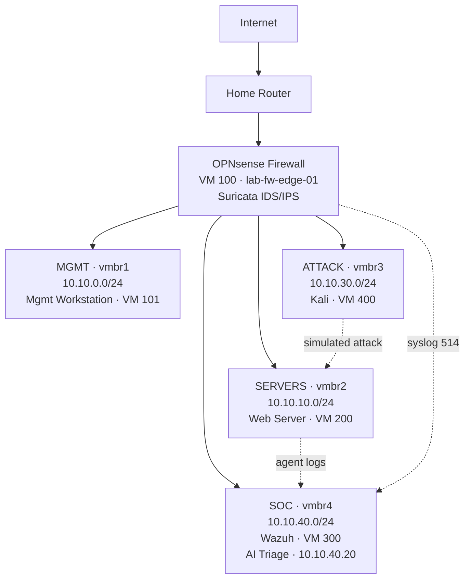
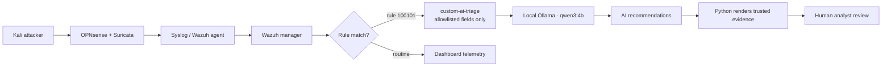

# Cybersecurity SOC Homelab

A Proxmox-based cybersecurity homelab designed for attack simulation, intrusion detection, SIEM monitoring, and blue-team / red-team practice.

## Skills Demonstrated

- Network segmentation and firewall policy design (OPNsense, VLAN-style zoning)
- SIEM deployment and administration (Wazuh)
- Intrusion detection with Suricata (IDS/IPS)
- Detection engineering: authoring and validating a custom Wazuh correlation rule
- MITRE ATT&CK mapping of observed activity
- Log-pipeline troubleshooting (syslog forwarding, rsyslog message-reduction)
- Controlled attack simulation and analyst-style triage
- Local-LLM integration for read-only, human-in-the-loop alert triage

## Ethical Use

All testing in this project was performed against isolated, self-owned lab
infrastructure using temporary, lab-only accounts. No public systems, networks,
or third-party accounts were targeted. The offensive tooling notes here exist to
validate detection coverage, not to enable unauthorized access.

## Overview

This project documents the design and implementation of a segmented virtual security lab using:

- Proxmox VE
- OPNsense firewall
- Suricata IDS/IPS
- Wazuh SIEM
- Kali Linux
- Ubuntu Server
- Ubuntu Desktop

The lab simulates a small enterprise network with separate zones for management, servers, attackers, and SOC monitoring.

## Lab Goals

- Practice network segmentation
- Simulate attacker behavior
- Detect attacks with Suricata
- Centralize alerts in Wazuh
- Build a reusable security research platform

## Architecture


## Virtual Machines

| VM ID | Name               | Role                   | Network                |
| ----: | ------------------ | ---------------------- | ---------------------- |
|   100 | lab-fw-edge-01     | OPNsense firewall      | WAN + all lab networks |
|   101 | lab-mgmt-util-01   | Management workstation | 10.10.0.0/24           |
|   200 | lab-srv-web-01     | Web server target      | 10.10.10.0/24          |
|   300 | lab-soc-monitor-01 | Wazuh SIEM / SOC       | 10.10.40.0/24          |
|   400 | lab-attk-kali-01   | Attacker machine       | 10.10.30.0/24          |

## Tools Used
- Proxmox VE
- OPNsense
- Wazuh
- Suricata
- Kali Linux
- Apache 2
- Nmap

## Detection Pipeline


## Validated Detection Scenarios

| Scenario | Tool | Evidence | Result |
|---|---|---|---|
| Network reconnaissance | Nmap | Suricata and firewall visibility | Detected |
| Web-server assessment | Nikto | HTTP findings and IDS visibility | Observed |
| SSH password guessing | Hydra | PAM logs and Wazuh rule `5551` | Detected |

### SSH Password-Guessing Case Study

A controlled Hydra simulation generated repeated SSH authentication failures
against a temporary test account. The Ubuntu host recorded failed logins
followed by a successful authentication attempt.

Wazuh correlated the activity into a level-10 alert:

```text
PAM: Multiple failed logins in a small period of time.

The alert mapped to MITRE ATT&CK: T1110 — Brute Force
```

### Alert Baseline and Noise Review

After validating the Hydra SSH password-guessing alert, I generated normal SSH
and HTTP traffic to compare benign behavior against attack activity.

The baseline demonstrated the difference between:

```text
One isolated authentication failure
→ monitor as low-priority telemetry

Repeated failures in a short period
→ correlated level-10 Wazuh alert
→ investigate as potential compromise
```

### Custom Wazuh Detection Engineering

After establishing a normal-traffic baseline, I created a custom Wazuh
correlation rule for a higher-risk SSH pattern:

```text
Five failed SSH login attempts
→ successful login from the same source IP
→ custom level-12 alert
→ investigate possible account compromise
```
The rule was validated with:

- wazuh-logtest
- a live sequential Hydra simulation
- a negative-control test
- live-telemetry troubleshooting after identifying rsyslog message compression

The rule definition is in [`configs/wazuh-custom/local_rules.xml`](configs/wazuh-custom/local_rules.xml).

## Detection Engineering Progression

This lab demonstrates a layered detection workflow using network, endpoint, and SIEM telemetry.

| Stage | Detection | Purpose |
|---|---|---|
| Baseline SSH activity | Linux authentication logs | Verify normal SSH login and failed-login visibility |
| Built-in Wazuh detection | Rule `5551` | Detect repeated SSH/PAM authentication failures |
| Custom detection engineering | Rule `100101` | Detect a successful SSH login after multiple failed attempts from the same source IP |
| AI-assisted triage | Local AI SOC agent | Generate a read-only analyst triage report for the high-risk custom alert |

The AI component does not automatically block IPs, disable users, or make containment decisions. It produces a structured advisory report for human analyst review.

## Repository Structure
- docs/ → design and implementation notes

- configs/ → firewall, Suricata, and Wazuh configuration references

- attacks/ → attack simulation notes

- diagrams/ → architecture images

- screenshots/ → dashboard and lab screenshots

## Future Improvements

- Zeek network telemetry

- packet capture and replay

- additional vulnerable applications

- threat intelligence integration

- automated attack simulation

## Local AI-Assisted SOC Triage

After validating custom Wazuh rule `100101`, I added a local read-only
AI-assisted triage workflow.

```text
Wazuh custom alert
→ sanitized JSON fields
→ local Ollama model
→ AI-generated investigation recommendations
→ Python-rendered authoritative evidence
→ human analyst review
```

The initial use case detects a successful SSH login after five failed
authentication attempts from the same source IP.

The agent does not execute containment actions or modify security controls.

Validation included:

- a high-priority positive-control test;
- a benign SSH-login test;
- a manual Wazuh-to-AI integration test;
- a live automatic AI-report test;
- a routine-login negative-control test.

## AI SOC Agent Validation

The AI SOC agent includes an offline validation path so the workflow can be tested without a live Wazuh or Ollama deployment.

Validation includes:

- redacted Wazuh sample alert parsing
- pytest-based unit tests
- JSON validation for sample alerts
- dry-run Markdown triage report generation
- GitHub Actions CI

This makes the triage workflow reproducible from a clean clone of the repository.

[Read the AI SOC triage-agent documentation](ai-soc-agent/README.md)

---

## Author

Trevor Henry Chiboora  
Cybersecurity Research Engineer
